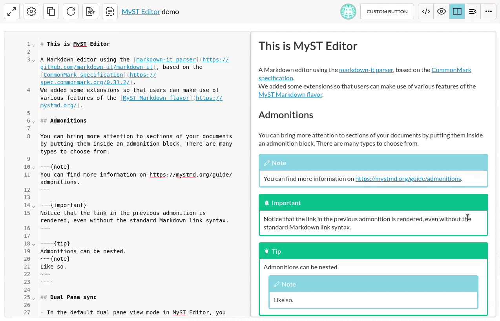
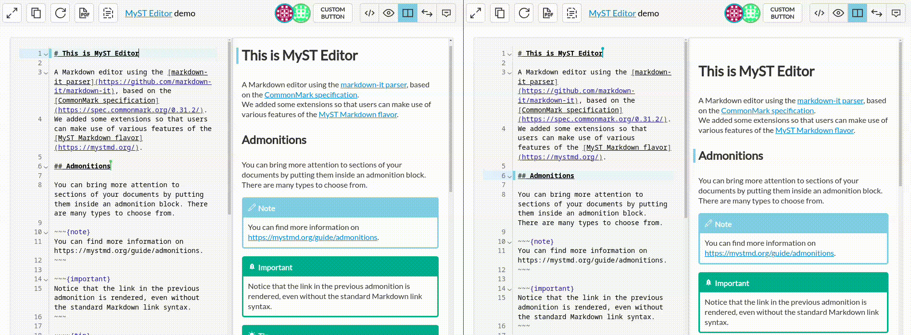
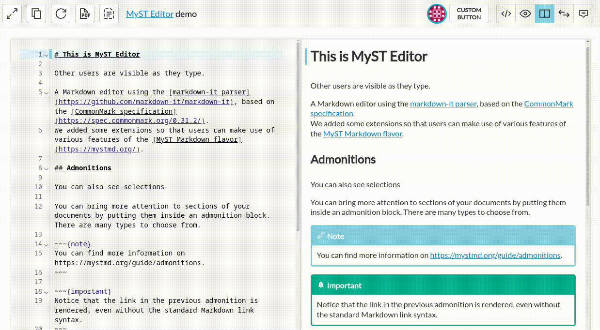
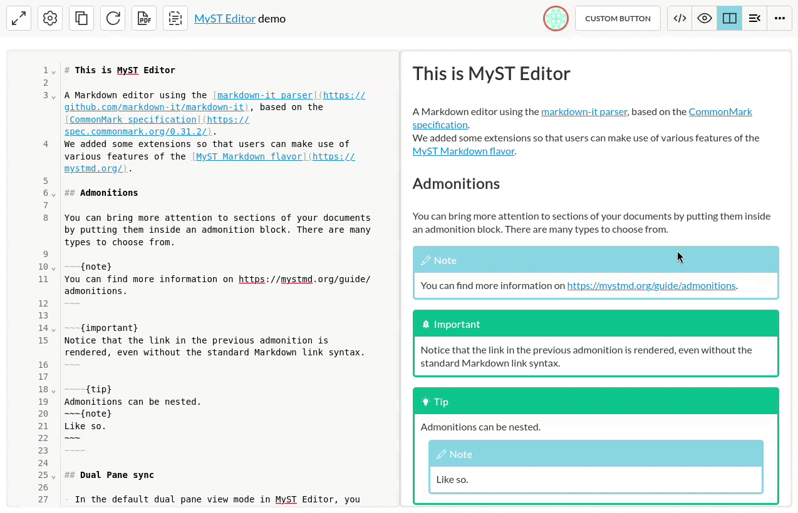
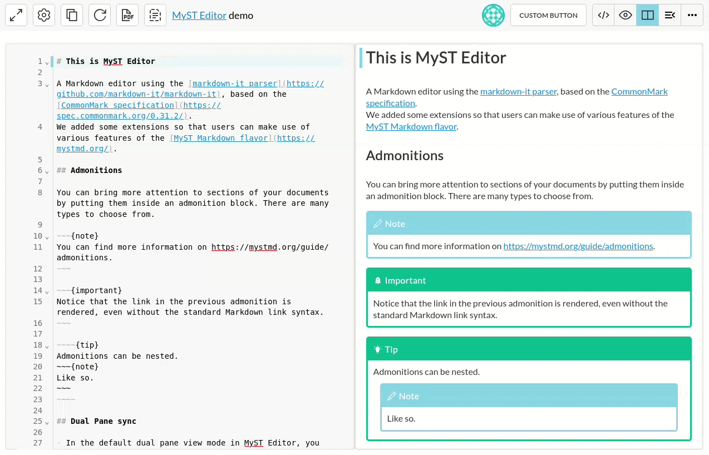
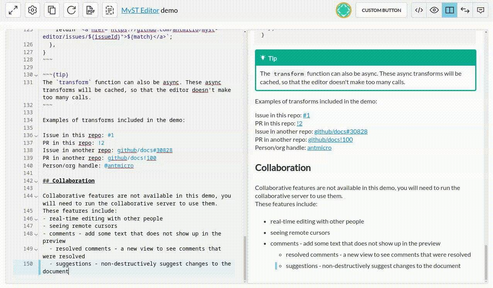

# MyST Editor

Copyright (c) 2022-2025 [Antmicro](https://antmicro.com)


This is a Markdown web editor that uses the [MyST Markdown](https://myst-parser.readthedocs.io/en/v0.16.0/) flavor.
It is implemented as a [Preact](https://preactjs.com/) component.
The intended way to use it is by embedding the editor in various websites/webapps.
It is written with collaborative editing in mind.

## User Manual

For an overview of the editor usage, see the [User Manual](https://antmicro.github.io/myst-editor/docs/).

## Demo

A demo of the editor is available [here](https://antmicro.github.io/myst-editor/).

## Main features

### Live preview and dual pane sync

Changes in the text editor are immediately reflected in the preview.
The editor also keeps track of where your cursor is and highlight and scroll the preview based on what you are editing.


### Inline Markdown rendering

You can toggle a mode where the Markdown will be rendered right in the editor.



### Collaborative editing

You can work on a document with multiple people at the same time.



### Comments

The editor has a comments feature, allowing you to add text that will not appear in the preview.


### Suggestions

You can suggest changes that others can accept or reject later.
Suggestions are based on the [CriticMarkup](https://fletcher.github.io/MultiMarkdown-6/syntax/critic.html) syntax.


### Templates

You can use document templates to quickly prepare documents and skip repetitive work.



### Diff

You can use the diff view to see exactly what changes have been made to the document as compared to the original state.
There is also an option to discard all the changes.



### Exporting the document

Using the buttons in the top-left, you can copy the rendered HTML or export the document to a PDF file.



### User settings

Users can customize the editor with the settings dropdown.
In the example below, we can see settings that allow for scrolling past the last line of the editor and a Vim emulation mode.



### Custom transforms

The editor allows you to extend the standard Markdown syntax with custom transforms.
You can specify regular expressions that turn some input to custom HTML output.
This is useful for implementing functionalities such as issue links, for example (as showcased in the demo):

```js
const transforms = [{
  target: /[0-9a-z\-]+\/[0-9a-z\-]+#\d{1,10}/g,
  transform: (match) => {
    const [repo, issueId] = match.split('#');
    return `<a href="https://github.com/${repo}/issues/${issueId}">${match}</a>`
  }
}]
```

Then provide the transforms array as the `transforms` option for the editor.

For more examples, see the `exampleTransforms` object in [the demo HTML](src/index.html).

## Usage

### Building the component

```bash
npm i && npm run build
```

### Using as a library

You can embed this editor on another website.

After building, you should see a `dist` folder with `MystEditor.css` and `MystEditor.js` in it.
Put those files alongside your HTML.

Add a link to the CSS file into your HTML:

```html
<link rel="stylesheet" href="MystEditor.css">
```

You need an HTML element that MyST Editor will attach to:

```html
<div id="myst"></div>
```

Add the following JavaScript as a module (of course add any options as needed):

```js
import MystEditor from 'MystEditor.js';
MystEditor({ /* options */ }, document.getElementById("myst"));
```

And voilà!

### Developing / running the demo

There is a demo available for the editor with some example Markdown and templates, also useful for development of the component itself.

To run it locally, use:

```bash
npm run dev
```

Your terminal will display what URL to open to see the demo.
You can edit the source files in `src/` to modify the behavior of the component, with hot reload, thanks to Vite.

An analogous demo deployed with GH actions from latest main should be deployed at https://antmicro.github.io/myst-editor/

### Collaboration server

The example server is located in the `bin` directory. To run it use:

```bash
cd bin
npm i && npm run server
```
You can change the port it runs on by setting a `PORT` environment variable.

### Customizing the CSS

Note that MyST Editor uses the Shadow DOM to encapsulate the styles from the rest of the page.
In order to customize the look and feel, you can change the CSS variables
listed in [MystStyles.js](./src/styles/MystStyles.js) with the `additionalStyles` option
of the `MystEditor` function.
The editor exports an example `darkTheme` stylesheet.

### MystEditor options

Here are the options you can pass to the MystEditor function:

- `id` *(default: `crypto.randomUUID()`)* - this changes where the global state of an editor is stored, it is used when accessing `window.myst_editor` and is part of the CodeMirror parent DOM id
- `name` *(default: "myst_editor_textarea")* - this will change the name of the textarea element which contains your markdown. Useful if you want the editor to be part of an HTML `form`.
- `additionalStyles` *(`CSSStylesheet` | `CSSStylesheet[]`)* - extra CSS stylesheets to customize the component
- `title` - the document title displayed in the topbar. You can include Markdown links in here.
- `mode` *(default: "Both", possibleValues: "Source" | "Preview" | "Both" | "Diff" | "Resolved" | "Outline" | "Inline")* - changes what is visible when you open the editor. By default, you will see a split view with the text editor and preview.
- `initialText` *(default: "")* - initial Markdown text
- `includeButtons` *(default: defaultButtons)* - An array of button definitions. A button definition is an object which has an `action: () => void` and either `icon` or `text`. As an example, a button could be defined as `{ text: "Button title", action: () => alert('clicked!') }`
- `topbar` *(default: true)* - whether to show the topbar
- `templateList` - path/url to a JSON file containing your document templates. For an example, see `public/linkedtemplatelist.json`.
- `collaboration` - options related to live collaboration:
  - `enabled` *(default: false)*
  - `commentsEnabled` *(default: false)* - enable basic comment functionality,
  - `resolvingCommentsEnabled` *(default: false)* - enable resolving comments,
  - `wsUrl` *(example: ws://example:4444)* - URL of the websocket server
  - `username`
  - `room` *(default: "0")* - name of the room to join, users will see others in the same room
  - `color` *(default: "#ff0000")* - color of the cursor seen by other users
  - `mode` *(default: "websocket")* - determines how the document will be synced. You can set it to `"local"` for testing without a server (using BroadcastChannel API)
- `spellcheckOpts` - Configuration for the spellchecker. If the value is *null* or *false* then the spellchecker will be disabled.
  - `dict` *(default: "en_US")* - Name of the desired dictionary. For an example, see `public/dictionaries/en_US`.
  - `dictionaryPath` *(default: "/dictionaries")*  - Path to a folder with dictionaries. For an example, see `public/dictionaries/`.
- `customRoles` - custom MyST roles. See [the demo HTML](./src/index.html) for examples.
- `transforms` - [custom transforms](#custom-transforms)
- `customDirectives` - custom MyST directives. See [the demo HTML](./src/index.html) for examples.
- `getAvatar` *(default: (login) => `https://secure.gravatar.com/avatar/${login}?s=30&d=identicon`)* - a function that returns the avatar for a given username
- `getUserUrl` *(default: (login) => `#`)* - a function that returns the URL to the web page with the user's profile
  It is used when an avatar is clicked.
- `backslashLineBreak` *(default: true)* - treat `\` as a line break even when it is at the end of a paragraph/block
- `hideUsernameDelay` *(default: 5000)* - milliseconds of inactivity after which the username attached to a remote cursor will be hidden
- `syncScroll` *(default: false)* - synchronize scrolling of the editor and preview in `Dual Pane` view mode.
  - > NOTE: This only works if you set a height limit on the editor parent element.
- `unfoldedHeadings` *(`number?`)* - fold all but the given number of top level syntax nodes on startup.
  If the option is not set, nothing will be folded by default.
- `mapUrl` *(default: (tag, url) => url)* - function used to map `href` and `src` attributes. Tag is the name of the HTML element and url is the source url you can transform.
- `yamlSchema` - must be an absoulte URL. If provided, a language server will launch in the background to provide tooltips, diagnostics and autocompletions based on the schema in YAML code blocks.
- `onPreviewClick` *(`(ev: MouseEvent) => boolean`)* - callback for when the preview is clicked, if the builtin click actions should be skipped, it should return `true`
- `onDiscardChanges` *(`() => void`)* - callback for when changes are discarded from the diff view mode
- `mermaidTheme` *(default: "neutral")* - theme to use for Mermaid.js diagrams
- `cmDarkTheme` *(default: false)* - whether to use a dark theme for CodeMirror

Also see [the demo HTML](./src/index.html) for an example on how you can set these options.
Using `window.myst_editor` or the return value of the `MystEditor` function, you can modify these options at runtime.

## Myst Editor for Git

There is an additonal wrapper around the base editor that is meant to be easy to integrate with Git version control.
The wrapper is provided as a component located in [src/myst-git/MystEditorGit.jsx](src/myst-git/MystEditorGit.jsx).
You can import it from a build of Myst Editor with the following syntax:
```js
import { MystEditorGit } from "MystEditor.js";
```
There is an example page that makes use of this wrapper in [src/myst-git/git.html](src/myst-git/git.html).
The example page can be accessed while the Editor is running in development mode via the following URL: `/myst-git/git.html`.

## License

[Apache 2.0](./LICENSE)
