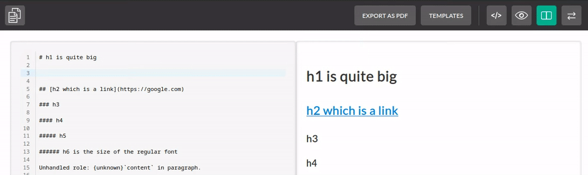
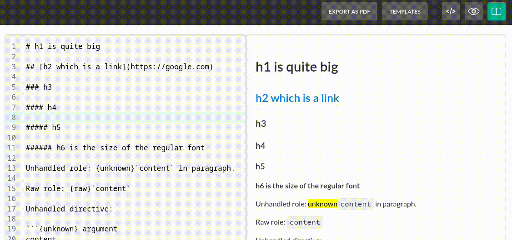
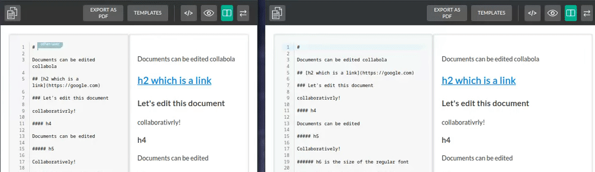
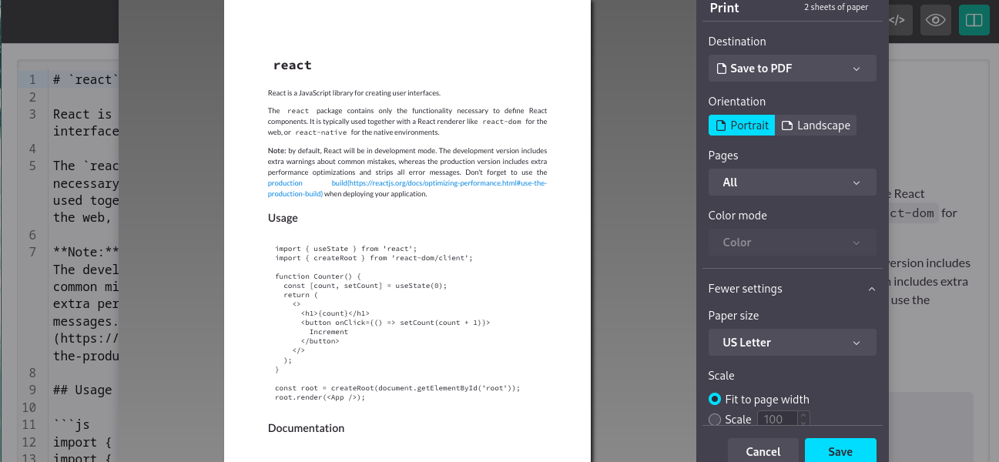
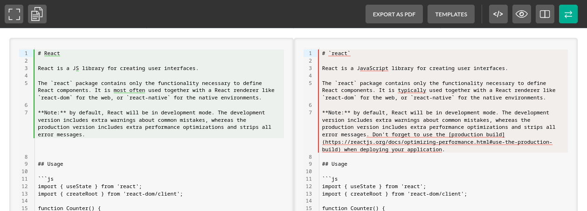
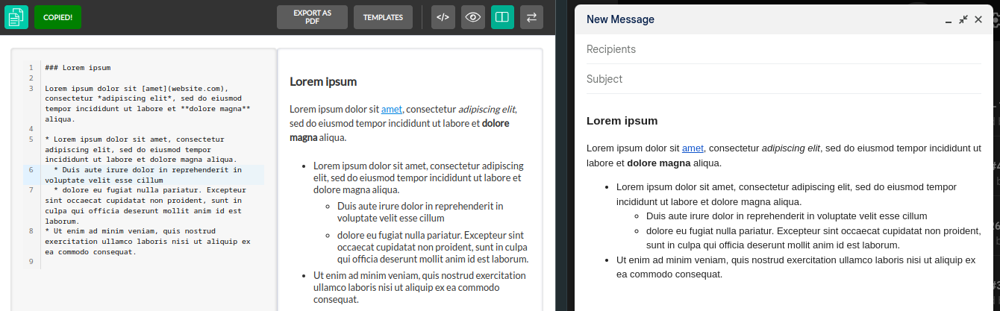

# MyST Editor

Copyright (c) 2022-2023 [Antmicro](https://antmicro.com)

This is a [MyST](https://myst-parser.readthedocs.io/en/v0.16.0/) editor in a [Preact](https://preactjs.com/) component, using [htm](https://github.com/developit/htm) as the templating language.

## Features

### Live preview

Changes in the text editor are immediately reflected in the preview.



### Templates

You can use document templates to quickly start documents and skip repetitive work.


### Changing the Layout

The editor can display the text area and preview area separately, or in a split view.



### Live Collaboration

You can work on a document with multiple people at the same time.



### Exporting to PDF

You can export the rendered markdown to a PDF file.



### See the changes you've made

You can use the diff view to see exactly what changes have been made to the document.



### Use the document in other editors

Copy and paste the document into other tools, such as email clients.



## Usage

### Building the component

```bash
yarn
yarn build
```

### Using as a library

You can embed this editor on another website.

After building, you should see a `dist` folder with `MystEditor.css` and `MystEditor.js` in it.
Put those files alongside your HTML.

Add a link to the css file into yout HTML:

```html
<link rel="stylesheet" href="MystEditor.css">
```

Add the following html where you want the editor to be:

```html
<div id="myst"></div>
```

Add the following javascript as a module (of course add any props as needed):

```js
import MystEditor, { html, render } from 'MystEditor.js'
render(html`<${MystEditor} />`, document.getElementById("myst"))
```

And voila!

### Developing / running the demo

There is a demo available for the editor with some example markdown and templates, also useful for development of the component itself.

To run it locally, use:

```bash
yarn dev
```

Your terminal will display what URL to open to see the demo.
You can edit the source files in `src/` to modify the behavior of the component, with hot reload thanks to Vite.

An analogous demo deployed with GH actions from latest main should be deployed at https://antmicro.github.io/myst-editor/

### Collaboration Server

The example server is located in the `bin` directory. To run it use:

```bash
cd bin
yarn && yarn server
```

You can change the port it runs on with setting a `PORT` environment variable.

### MystEditor Props

Here are the props you can pass to the MystEditor component:

- `name` *(default: "myst_editor_textarea")* - this will change the name of the textarea element which contains your markdown. Useful if you want the editor to be part of an html `form`.
- `id` *(default: "myst_editor_textarea")* - changes the id of the textarea
- `initialMode` *(default: "Both", possibleValues: "Source" | "Preview" | "Both")* - changes what is visible when you open the editor. By default you will see a split view with the text editor and preview.
- `initialText` *(default: "")* - initial markdown text
- `printCallback` *(default: window.print())* - gets called when you click the `Export to PDF` button
- `topbar` *(default: true)* - whether to show the topbar
- `templateList` - path/url to a JSON file containing your document templates. For an example see `public/linkedtemplatelist.json`.
- `collaboration` - options related to live collaboration:
  - `enabled` *(default: false)*
  - `wsUrl` *(example: ws://example:4444)* - url of the websocket server
  - `username`
  - `room` - name of the room to join, users will see others in the same room
  - `color` - color of the cursor seen by other users
- `spellcheckOpts` - Configuration for the spellchecker. If the value is *null* or *false* then the spellchecker will be disabled.
  - `dict` *(default: "en_US")* - Name of the desired dictionary. For an example see `public/dictionaries/en_US`.
  - `dictionaryPath` *(default: "/dictionaries")*  - Path to a folder with dictionaries. For an example see `public/dictionaries/`.

## License

[Apache 2.0](./LICENSE)
