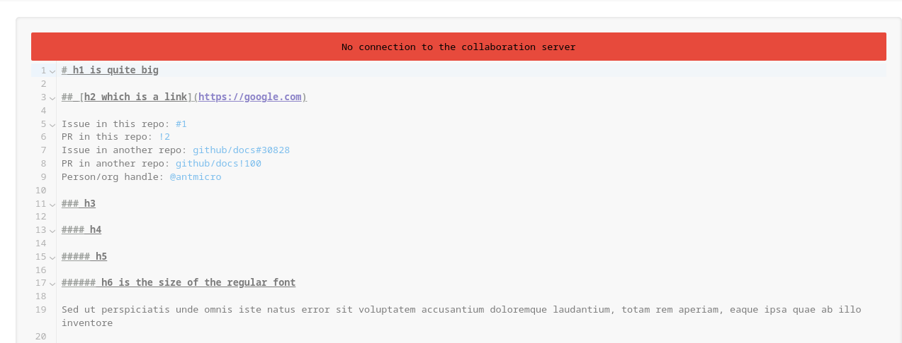

# Collaboration

MyST allows multiple users to edit a document simultaneously.
You can see how many users are editing a document by looking at their avatars in the [topbar](topbar.md).
A username and a color are assinged to each user.

You can see the cursors of other users in their respectful colors in the editor with their usernames attached.
Your cursor will be a simple vertical bar.

Whenever someone makes a selection it will also be visible.

## Connection Issues

:::{figure-md} connection-error


Connection Error
:::

Should you run into connection problems, an error will be displayed and the editor will be locked.
In such case, please check your internet connection and restart the editor.
If you do have internet access and the issue still continues, the collaboration server might be offline.

```{warning}
Changes made in the editor while offline are lost, but a connectivity error should lock the editor and prompt you to restart.
```

## Other Collaborative Features

There are many more MyST features aimed at collaboration.
For more information refer to the [](comments.md) and [](rich-links.md) sections.
