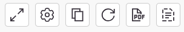
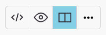
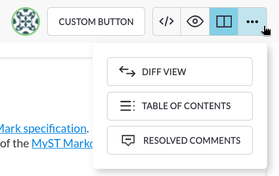

# Topbar

The editor topbar contains information and buttons.

## Left side buttons

:::{figure-md} left-side-buttons


Left-side topbar buttons
:::

Starting from the left, the left side topbar visible in {numref}`left-side-buttons` includes the following buttons:

- `Fullscreen` - toggles fullscreen editor mode
- `Settings` - opens the [Settings](settings.md) dropdown
- `Copy document as HTML` - copies the rendered document exported as HTML
- `Refresh issue links` - re-renders all [rich links](rich-links.md) in the document
- `Print to PDF` - save the rendered document as a PDF file or print it
- `Templates` - applies a template for projects that support the feature.
  
  ```{warning}
  Applying a template while there is already text in the document will replace all the text with the template. 
  You can undo this action, however any comments in the document will be removed.
  ```
- `Toggle suggest mode` - toggles a mode that turns all your changes to the document into suggestions.

## Document Name

Displays the name of the document, for example the name of an issue, documentation page or meeting.

## User Avatars

Avatars of users currently editing a document will be displayed in the topbar. 
With several collaborators, only a couple avatars are displayed with an indicator of how many more are editing.

```{tip}
Hovering over an avatar or the "more users" indicator reveals usernames.
```

## Custom Buttons

Depending on the configuration of the editor, you can add more buttons.

## View Mode Buttons

:::{figure-md} view-mode-buttons


View Mode buttons
:::

MyST editor has several view modes, activated with buttons on the right side of the topbar, as illustrated in {numref}`view-mode-buttons`.
Starting from the left, the buttons serve the following functions:

- `Source` - only show the Markdown source code
- `Preview` - only show a rendered document preview
- `Dual Pane` - **(default)** - show Markdown on the left and a rendered preview on the right
- `Inline Preview` - a hybrid mode combining both the Markdown source and rendered content

:::{figure-md} view-mode-buttons-expanded


Additional View Modes
:::

There are also some additional views provided, accessible by hovering over the last icon, as illustrated in {numref}`view-mode-buttons-expanded`:
- `Diff View` - show changes made to the document
- `Table of Contents` - a multi-level list of all headings in the document. Clicking on headings navigates to them.
- `Resolved Comments` - show resolved comments, for more information see [Resolving Comments](comments.md#resolving-comments).
